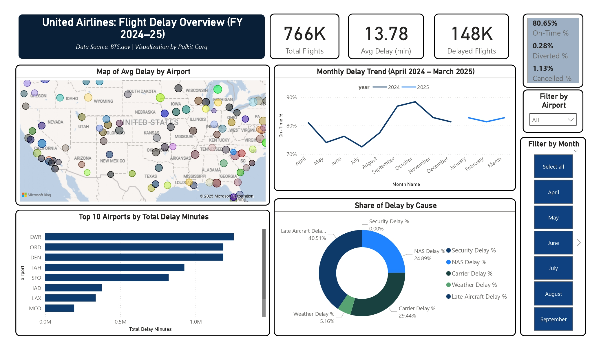

# ✈️ United Airlines Flight Delay Analytics – Power BI Dashboard

**📅 Period**: April 2024 – March 2025  
**📍 Coverage**: 126 U.S. airports  
**📊 Flights Analyzed**: ~851,000 (United Airlines only)  
**🛠️ Tools Used**: Power BI, Power Query, DAX, SQL (for preprocessing)

---

## 🚀 Project Overview

This multi-page Power BI dashboard dives deep into United Airlines' flight performance across the U.S., highlighting delay patterns, root causes, and strategic recommendations aimed at enhancing on-time performance and customer experience.

---

## 📌 Key Features

### 🧩 Page 1 – Executive Summary
- KPIs: Total Flights, On-Time %, Average Delay, Cancellation Rate  
- Visuals: Monthly On-Time Trend, Delay Cause Donut, Top 10 Delayed Airports  
- Filters: Airport, Month, Cause  

### 🔍 Page 2 – Root Cause Analysis
- Breakdown of delays by cause (Carrier, NAS, Weather, etc.)  
- Comparison between Delay Minutes vs Delay Counts  
- Interactive Q&A search box and Decomposition Tree  

### 📈 Pages 3 & 4 – Strategic Insights & Forecast
- Forecasted On-Time % trends with target line  
- Matrix: Average Delay per Incident by cause  
- Key Influencer analysis  
- Executive summary with actionable recommendations  

---

## 📎 Project Files

| File | Description |
|------|-------------|
| [`United_Airlines_PowerBI_Report.pbix`](/United_Airlines_PowerBI_Report.pbix) | Full Power BI report file |
| [`United_Airlines_PowerBI_Report.pdf`](/United_Airlines_PowerBI_Report.pdf) | Exported PDF of all report pages |
| [`/screenshots/`](screenshots) | High-res page images for portfolio use |

---

## 💡 Strategic Outcomes

- **Top 3 delay causes** account for ~72% of all delays  
- Focused recommendations around NAS and Late Aircraft delays  
- Scalable model architecture for analyzing other carriers or time periods

---

## 📷 Preview

---

## 🔗 Related Links

- 📂 [All Power BI Projects](https://github.com/pulkitgarg3/PowerBI_Portfolio_Pulkit)  
- 🌐 [My Portfolio Website](https://pulkitgarg3.github.io/Pulkit-Portfolio/)

---

## 🙌 About the Author

Created by **Pulkit Garg** — MBA specializing in Analytics & Marketing  
🔗 [LinkedIn Profile](https://www.linkedin.com/in/pulkitgarg03)

---

> ⚠️ **Note**: Data is sourced from U.S. DOT Aviation Statistics for academic and demonstration purposes.

